# Claude Keeper

[](https://github.com/AICodeDoctor/claude-keeper/actions/workflows/ci.yml)
[](https://github.com/AICodeDoctor/claude-keeper/actions/workflows/release.yml)
[](https://github.com/AICodeDoctor/claude-keeper/actions/workflows/jekyll-gh-pages.yml)
[](https://signpath.io)

🌐 **Website:** <https://AICodeDoctor.github.io/claude-keeper/>

> Cross-platform desktop app that hosts the Claude Code CLI inside an embedded
> terminal, detects when the Pro-plan usage limit is reached (5-hour rolling and
> weekly caps), waits until the stated reset time **plus a 1-minute safety
> buffer**, then **types "continue" + Enter into the still-open session** —
> exactly what you would do by hand — so long-running work survives the limit
> without you babysitting it.

Runs on **Windows, macOS, and Linux**. Machine-agnostic: no hardcoded paths or
drive letters. The real `claude` binary is **not** required to develop or test —
a deterministic mock CLI drives the entire automated test suite.



<!-- The demo above is a self-contained animated SVG generated by
     `npm run demo` (scripts/make-demo.mjs); it mirrors the fake-claude test CLI.
     For a polished screen-recorded GIF of the real app, follow the storyboard
     in PROMOTION.md and drop it in docs/assets/. -->

**Never babysit a usage limit again** — hit the cap, walk away, and Claude Keeper
types `continue` for you the moment the limit resets. It does **not** bypass limits
or touch the Anthropic API; it only waits for the legitimate reset.

👉 **Download & docs:** <https://AICodeDoctor.github.io/claude-keeper/>

---

## What it does

1. Runs the Claude CLI inside an interactive [xterm.js](https://xtermjs.org/)
   terminal (real PTY via ConPTY on Windows, `forkpty` on macOS/Linux).
2. Watches the output for the usage-limit message — the 5-hour rolling cap
   (`Claude usage limit reached. Your limit will reset at <time> (<tz>).`), the
   **weekly** cap (`You've reached your weekly usage limit … Resets <time>`), and
   the newer **session** phrasing that pairs the limit noun with "resets" instead
   of "reached" (`You've hit your session limit · resets <time> (<tz>)`). As an
   encoding-robust backstop — Claude varies spacing and apostrophe glyphs between
   builds — it also matches any line where the words **"limit"** and **"reset"**
   co-occur within the same sentence or two consecutive sentences. In-place
   TUI repaints (cursor moves/erases instead of newlines) are treated as line
   breaks, so a banner painted over an old "used 71%" status can't be missed.
   Detection patterns are configurable and apply live to a running session.
3. When the CLI pauses on its **rate-limit options menu** ("What do you want to
   do?" with paid options like extra usage next to *Stop and wait for limit to
   reset*), Claude Keeper **answers it automatically with "Stop and wait for
   limit to reset"** — never a blind Enter, since the pointer may start on a
   paid option. The session then parks safely for the scheduled resume.
4. Parses the reset time (timezone-aware), falling back to interval polling.
5. Enters a **waiting stage**: the Claude session is left open exactly as it
   was, with a live status bar + countdown, until the reset time **plus a
   safety buffer** (default 60 s, configurable).
6. **Auto-resumes** when the timer runs out by typing the resume prompt
   (default `continue`, configurable) plus Enter into the live session. If the
   CLI died in the meantime (or the app was restarted mid-wait), it relaunches
   `claude --continue` first and then types the prompt.
7. Verifies the resume took (retries with backoff if the limit message comes
   back), and **Resume now** skips the countdown whenever you want.
8. Survives **app restart and laptop sleep** mid-wait (state persisted to disk).

It does **not** bypass limits or touch the Anthropic API — it only observes
terminal output and waits for the legitimate reset.

---

## Quick start (from source)

Requirements: **Node 22+** and the [`claude`](https://docs.anthropic.com/en/docs/claude-code)
CLI on your `PATH` (only needed to actually use the app — not for tests). On
macOS/Linux the app **repairs `PATH` for GUI launches** (Finder/Dock, `.desktop`,
AppImage), so a `claude` installed via Homebrew/npm/version-manager shims is found
even though GUI processes don't inherit your login-shell `PATH`.

```sh
git clone https://github.com/AICodeDoctor/claude-keeper
cd claude-keeper
npm ci
npm run dev        # launch the app in development
```

The default command is just `claude`, resolved from your PATH. Command, args,
working directory, resume prompt, and safety buffer are all configurable in
**Settings**, along with **working-directory trust** (skips Claude's
folder-trust prompt via `--dangerously-skip-permissions`), custom
**limit-detection patterns**, and **diagnostics**: verbose logging and an
optional **size-rotating log file** (off by default, 10 MB default, openable
from Settings).

---

## Building installers

Packaging uses [electron-builder](https://www.electron.build/). **Each OS builds
its own artifacts** — you cannot cross-build a macOS `.dmg` from Windows, etc.
Use CI (see below) to produce all three at once.

```sh
npm run pack         # unpacked build into dist/  (fast sanity check)
npm run dist:win     # Windows: NSIS installer + zip (x64, arm64)
npm run dist:mac     # macOS: dmg + zip (x64, arm64)
npm run dist:linux   # Linux: AppImage + deb (x64, arm64)
npm run dist         # all targets for the current OS
```

Output lands in `dist/`. The native `node-pty` module is unpacked from the asar
automatically (`asarUnpack` in `electron-builder.yml`).

### Continuous integration & releases

Two GitHub Actions pipelines live in `.github/workflows/`:

- **`ci.yml`** — on every push/PR to `main`: typecheck + the full test suite,
  then a build + smoke check on `windows-latest`, `macos-latest`, and
  `ubuntu-latest` to catch platform-specific breakage.
- **`release.yml`** — on a `v*` tag (or manual dispatch): re-runs the tests,
  then packages each platform/arch on a **native runner** (Windows x64 +
  arm64, macOS Intel + Apple Silicon, Linux x64 + arm64) so every binary gets
  the correct node-pty prebuild, generates `SHA256SUMS.txt`, and publishes
  every artifact to a GitHub Release.

Cut a release by tagging:

```sh
git tag v0.1.0 && git push origin v0.1.0
```


---

## Development

```sh
npm run typecheck    # tsc --noEmit
npm test             # full vitest suite (no Electron, no real claude needed)
npm run build        # electron-vite production build into out/
npm run smoke        # boots the built app headless to verify wiring
```

### Architecture

Three Electron processes; the **core logic is kept Electron-free and pure** in
`src/core/` so it is fast to unit-test:

- `src/core/` — `SessionController` state machine, `LimitDetector`,
  `ResetTimeParser`, `ResumeScheduler`, wait-state model.
- `src/main/` — Electron main: PTY host, settings store, fs-backed wait store,
  IPC wiring, recovery handshake.
- `src/preload/` — minimal `contextBridge` surface (no Node in the renderer).
- `src/renderer/` — xterm terminal, status bar, countdown, settings, log.

Runtime config lives in `app.getPath('userData')` (per-OS, per-user) and can be
redirected with the `CLAUDE_KEEPER_DATA_DIR` environment variable (used by tests
and the sandbox).

See [`docs/DESIGN.md`](docs/DESIGN.md) for the full design and build plan and
[`docs/MANUAL-TESTING.md`](docs/MANUAL-TESTING.md) for verifying against the real
Claude CLI.

---

## License

MIT — see `package.json`.

## Code signing

Windows binaries are signed with a free code-signing certificate provided to
open-source projects:

> Free code signing for Windows binaries is provided by [SignPath.io](https://signpath.io),
> using a certificate from the [SignPath Foundation](https://signpath.org).

macOS binaries are signed and notarized with an Apple Developer ID when those
credentials are configured. See [`docs/SIGNING.md`](docs/SIGNING.md) for the full
signing setup (SignPath application, required secrets/variables, artifact
configuration, and macOS notarization).

## Verifying downloads

Every release includes a `SHA256SUMS.txt` listing the SHA-256 hash of each
binary. After downloading an installer, verify it matches:

**Windows (PowerShell):**

```powershell
# Compare this against the matching line in SHA256SUMS.txt
Get-FileHash .\Claude.Keeper-1.0.0-beta-x64.exe -Algorithm SHA256
```

**macOS / Linux:**

```bash
# Download the installer and SHA256SUMS.txt into the same folder, then:
sha256sum --check --ignore-missing SHA256SUMS.txt
```

A matching hash confirms the file wasn't corrupted or tampered with in transit.
